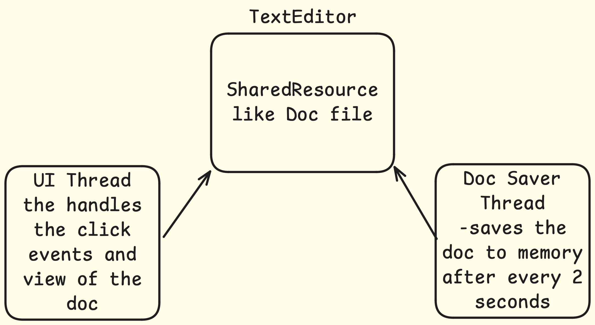
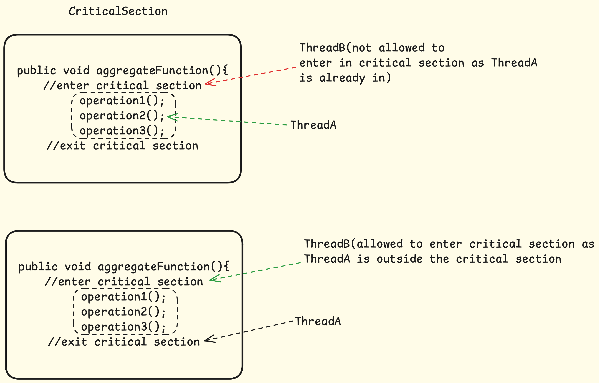

# Java Concurrency

- [Java Concurrency](#java-concurrency)
  - [Some Basics of OS,Thread,Process](#some-basics-of-osthreadprocess)
  - [Thread creation](#thread-creation)
    - [Thread Creation- MultiExecutor](#thread-creation--multiexecutor)
  - [Thread termination, Daemon threads](#thread-termination-daemon-threads)
  - [Thread co-ordination `Using Thread.join()`](#thread-co-ordination-using-threadjoin)
  - [Performance in Multithreading](#performance-in-multithreading)
  - [Stack and Heap](#stack-and-heap)
  - [Resource sharing between threads](#resource-sharing-between-threads)
  - [Shared Resource handling using join()](#shared-resource-handling-using-join)
  - [Critical section](#critical-section)
  - [Atomic Operations](#atomic-operations)
  - [Race Condition](#race-condition)
    - [Race Condition solution](#race-condition-solution)
  - [Data race](#data-race)
  - [Locking Strategies and Deadlocks](#locking-strategies-and-deadlocks)


## Some Basics of OS,Thread,Process
When you boot your application, os is loaded from disk to main memory and it facilitates the access of computer hardware to the running application in the machine.

**Process**: Instance of application running on the core(s) on the machine is called program or process

**Thread**: Single execution unit of the process, each process can have many threads as part of the same process.
Each thread have separate execution point ( execution point is the part of the program that the thread is responsible for running) and stack(local variable that are created as part of the thread execution), they share rest of the other things with the other threads of the same process, like Heap, code, opened files by the process, metadata of the process.
Context switching between threads are cheap compared to context switch between processes.

*FYI*, **Concurrency = Multithreading**

## Thread creation

---

### Thread Creation- MultiExecutor

```java
import java.util.List;
import java.util.*;
public class MultiExecutor {

    // Add any necessary member variables here
    List<Thread> threads = new ArrayList<>();

    /* 
     * @param tasks to executed concurrently
     */
    public MultiExecutor(List<Runnable> tasks) {
        // Complete your code here
        for(Runnable task: tasks){
            threads.add(new Thread(task));
        }
    }

    /**
     * Starts and executes all the tasks concurrently
     */
    public void executeAll() {
        // complete your code here
        for(Thread t : threads){
            t.start();
        }
    }
}
```

## Thread termination, Daemon threads
Stop threads by calling thread.interrupt() method
```java
...
Thread thread = new SomeThread();
thread.interrupt();
...
//the program throws InterruptedException explicitly
class SomeThread extends Thread{
    @Override
    public void run(){
        try{
            this.sleep(5000000);// explicitly throws 
            //InterruptedException
        }
        catch(InterruptedException()){
            //sysout something and exit or return 
        }
    }
}
```
If the method does not respond the interrupt signal by throwing the interrupted exception,we need to check for that signal(thread.isInterrupted()) and handle that ourselves.

```java
// if the program does not throw InterruptedException explicitly
...
class SomeThread extend Thread{
    @Override
    public void run(){
        ...
        if(thread.isInterrupted()){
            //do something
            //and return or exit the thread 
            //System.exit(0);
        }
        ...
    }
...
}

```
To prevent a thread from blocking our app from exiting we make the thread to be daemon thread
```java
Thread thread = new SomeThread();
thread.daemon();

```
By doing this the daemon thread might still run in the background but it will not prevent the main thread from completing or exiting 

## Thread co-ordination `Using Thread.join()`

*How do we guarantee that a thread 't1' on which Thread 't2' depends completed first before the dependent thread 't2' can run?*

```
public final void  join()
public final void join(long millis, int nanos)
public final void join(long millis)
```
**Example** calculating factorials of list of numbers by assigning calculation of number to a different thread, and making the main thread depend on this factorial calculating thread 
Refer this `/join/Main.java` for more details

```java
package JavaConcurrency.join;

import java.math.BigInteger;
import java.util.ArrayList;
import java.util.List;

public class Main {
    public static void main(String[] args) {
        List<Long> list = List.of(0l,20l,454l,767l,3333787l);

        //crating separate thread for each long value
        List<FactorialThread> threads = new ArrayList<>();
        for(Long n : list){
            threads.add(new FactorialThread(n));
        }
        //running each thread in threads list
        for(Thread t : threads){
            t.start();
        }
        //main thead will check if the threads are finished calculating the factorial
        //if yes we print the factorial of the given number or else we print factorial calculation is 
        //still in progress
        /*
         * Note: here the Factorial threads and the main thread are racing towards the goal independently 
         * and we don't know which one will be in which stage by the time main thread is checking for the result in the below for loop
        */
        for(int i =0;i<list.size();i++){
            if(threads.get(i).isFinished()) System.out.println("factorial of "+ list.get(i) + " "+ threads.get(i).getResult());
            else System.out.println("factorial of "+ list.get(i) + " is still in progress");
        }
    }
}
class FactorialThread extends Thread{
    private long inputNumber = 0;
    private BigInteger result = BigInteger.ZERO;
    private boolean isFinished = false;
    public FactorialThread(long n){
       this.inputNumber = n;
    }
    @Override
    public void run(){
        result = factorial();
        this.isFinished =true;
    }
    public BigInteger factorial(){
        BigInteger multiply = BigInteger.ONE; //base for the multiplication
        for(long i  = inputNumber;i>0;i--){
            multiply = multiply.multiply(new BigInteger(String.valueOf(i)));
        }
        return multiply;
    }
    public BigInteger getResult(){
        return this.result;
    }
    public boolean isFinished(){
        return this.isFinished;
    }
}
```

Using join()

```java
public class Main {
    public static void main(String[] args) throws InterruptedException {
       ...
        //running each thread in threads list
        for(Thread t : threads){
            t.start();
        }
        //forcing the main thread to wait till all the Factorial threads and finished
        // by the time main thread finished this loop all the Threads would guaranteed to have been finished
        for(Thread t : threads){
            t.join();// throws InterruptedException
        }
        for(int i =0;i<list.size();i++){
            if(threads.get(i).isFinished()) System.out.println("factorial of "+ list.get(i) + " "+ threads.get(i).getResult());
            else System.out.println("factorial of "+ list.get(i) + " is still in progress");
        }
    }
}
```
If one of the numbers are tool large then the main thread will go in indefinite wait state as the one of the threads with very large value would still be in running state, which is not at all great
Hence whenever we are using the join() we should also specify the max amount of time we are will wait for each worker thread e.g like 2 seconds: join(2000);

```java
public class Main {
    public static void main(String[] args) throws InterruptedException {
        List<Long> list = List.of(0l,20l,454l,767l,3333333l);

        ...
        //forcing the main thread to wait till all the Factorial threads and finished
        // by the time main thread finished this loop all the Threads would guaranteed to have been finished
        for(Thread t : threads){
            t.join(2000);// throws InterruptedException
        }
        ...
    }
}
```

```output
factorial of 0 1
factorial of 20 2432902008176640000
factorial of 454 726708081635420599109931380365806260520362685397635026628601772208395897450354212691707492678044117903897031784533438945766597613438358238692618741957993044081545346151037013462357108828092989683267661618696363066332721393468697096383557780482524766971776576182865944755143254470187878555555595708046793785084767457997226090730411991248968075645749637206365776279533929559060221605943536612588988415821828768008025269986733152376670559577680529993855825610384120649903552388844258719420605128654808438674544278424305144620789279556220941760911684018533837088247881573383873715624932169652117446718853446032703117846790107903952904178402377237612198116275077609272753044219838355335955898065170574703143182216372415852187148841846085231768045598014673954142557132082593726546484934258289856831658328481328852144657250484060133614476715420370800841441354124509790885373767762498333858260690053221056512000000000000000000000000000000000000000000000000000000000000000000000000000000000000000000000000000000000000000
factorial of 767 2375260959611012304762670562014361042438984145402220668778622781714011973204885586721482102170138158017912909951749136618152622129665396063239798755672359045046791829533325912027294542599629170699575537786862911468691373814785865095468673736329346200056801571256348847559429853735176210547154678930278110511566678722555512623148840981131519045028867092173070167152372046754942891599061407539992464813252446967500735310145266296308132663082347129938078910331766655962259524538226270268104901185069573299029741119207595046240433933652690636018226038180892363217411319419952117838233703303843335265621971744866701765360122693268656816241096593766867249468004712749335136620049127184532630665619974867030240370421565462309102083926831653585488121267996060830575065845534255204509489976997933497386133447457547860847341819440144231159324744764530120855729783651147993024383690557821638843032047063145228296241119775491129809030007423558887873049500258661443702180595441168549636198954131395416728355849072111498959229220199120476066753251229458761083689692200991808920078198442112854567368210648292329483868634825497591200676735959800089399606277491034162279182789675964205461407646146661046051865013633074481520637074466035945061616169856730344083745794661432890037380035825505170435051667885361002009644379180722347858564162542575422949400582115109252055775393792922796353732115146238331643390217113530018198252136416847295453203475440225315019861541206341202256543805373542358516244106639143943315487105537971115211314630563055351227453941395167633007855277738336583656455370724924172069333701790302842920421216455014139794193231455016709118778441998062756692085736002862854169040545221003182080000000000000000000000000000000000000000000000000000000000000000000000000000000000000000000000000000000000000000000000000000000000000000000000000000000000000000000000000000000000000000000000
factorial of 3333333 is still in progress
```
But the application would still be running, so we need to interrupt the thread to exit from the application

```java
    ...
        //running each thread in threads list
    for(Thread t : threads){
        t.setDaemon(true);//to make the application exit even when the threads are not finished
        //we can also think of interrupting the thread 
        t.start();
    }
    ...
```

## Performance in Multithreading

**Latency**: Time taken to complete a task
**Throughput**: No. of tasks completed in a given time period, measured in tasks/time units


## Stack and Heap


Every **variable**,**object**, **object reference** declared at the **class level** are stored in the **heap** and is shared among the thread,
Every **variable**, **object reference** declared inside a **method** is present on the thread **stack** (which is separate for each thread) if two or more threads are executing the same method then they all will
have different versions of the variables present in the method, Hence synchronization is required.

**Note**: Objects are always stored on the heap memory irrespective of the place of created be it class level or method level

## Resource sharing between threads
*Example 1*

*Example 2*
Another example would be **consumer threads** consuming from same(**shared**) queue like kafka

[Shared Resource handling using join()](readmaterialfromudemy/critical-sections-and-synchronization-example/src/Main.java)
--
But it comes with an issue if we use join() for each Thread to execute sequently then it will behave like a single thread and there **won't be any point of using multiple threads**

How to insure the **atomic operation** of the shared resource ?: By making sure that the critical section of the code which is shared among the threads are accessed exclusively by one thread at a time

## Critical section



How to achieve the exclusive access of the Critical section? ***Using Synchronization***

1. Synchronized- Monitor
   Using synchronized keyword in the method
   ```java
   public synchronized void increment(){
    item++;
   }
   public synchronized void decrement(){
    item--;
   }
   ```
2. Synchronized - lock
   1. Instead of applying synchronized keyword on the entire method we can lock the specific part of the method which is considered Critical Section
   2. lock is more fine grained
   
    This is same as the above code
   ```java
   public void increment(){
    synchronized(this){
        item++;
    }
   }
   public void decrement(){
    synchronized(this){
        item--;
    }
   }
   ```
   This is also same as above and yield the same result
   ```java
   Object lock  = new Object();
   public void increment(){
    synchronized(lock){
        item++;
    }
   }
   public void decrement(){
    synchronized(lock){
        item--;
    }
   }
   ```
        Synchronized block are something called **reentrant**
        meaning if ThreadA is accessing a synchronized method while already being in a different synchronized method or block, it will be able to access that synchronized method with no problem

## Atomic Operations 

We want to make sure that the shared resources are accessed exclusively to insure atomicity, but for this to happen we have to identify which operations are supposed to be atomic operations because not all the operations require atomicity.

Example of some atomic operations

1. All reference assignment operations are atomic
We can get and set references to object atomically
```java
Object a = new object();
Object b = new Object();
a = b;//atomic
```
**This means that all our getters() and setters() methods of primitive types and references do their operations atomically and we don't have to synchronize them.**

2. All assignment to primitive types are safe except long and double 
   1. That means reading from and writing to following types int,float,char,short,byte,boolean
   2. long and double are exception to the previous rule because they are 64 bit long and the cpu might require two operations one write to lower 32 bits and another write to upper 32 bits
   3. Solution for long and double is to use `volatile` keyword, this makes write/reads to the long/double variable thread safe and atomic.

[Refer to this example for atomic operations in multithreaded settings](atomicOperations/readme.md)


## Race Condition

We already discussed the race condition, this occurs when a shared resource is accessed in non atomic atomic fashion and the order of completion of the threads leads to unexpected state of the shared resource
### Race Condition solution
- Identification of the critical section where the race condition is happening
- Protection of the critical section by `synchronized` block

## Data race
- When set of instruction in a method are not dependent on each other then the compiler re-arranges them for efficiency and cpu executes those instructions in any order as the order does not matter as long as the logical correctness of the code is not broken.
- [consider this example ](readmaterialfromudemy/data-races-example/src/Main.java)
    - In the above example `x++` and `y++` are not dependent on each other both can be executed in any manner as after the method call end result will be `x==y` (This is the expected behavior)
    - But in multithreaded environment there might be situation where another thread is running on the cpu on another core and reading the same variables and relies on the particular order of their execution as a result me may see broken behavior where y>x which should never be the case, this is called `Data Race`.

## Locking Strategies and Deadlocks

Deadlocks: Is kind of circular dependency where one thread A is dependent of another Thread B to release the lock held on resource that A needs while A has locked a resource that B needs to progress

For more fine grained locked we created multiple objects for getting locks on the shared resource but this may lead to deadlock

**Condition for deadlock**

Mutual exclusion: Only one thread can have exclusion access to a shared resource
Hold and wait: At least one thread is holding a resource and waiting for another resource
No preemption: A resource is released only after the thread is done using it
Circular wait: A chain of at least two threads each one is holding a resource and waiting for another resource

**If any of this conditions is met then deadlock is eminent and it is only matter of time**
Solution: 
- Make sure at least one of the condition from above is avoided
- Avoiding Circular wait is easy and best approach, in order to do this we **specify strict order in which the lock can be acquired on resource**.
- [This leads to dead lock](readmaterialfromudemy/deadlocks-example/src/Main.java) to fix this give fix order for the lock acquiring [as shown here](readmaterialfromudemy/deadlocks-example/src/CircularDeadlockFix.java)


**Udemy course reference**
Java Multithreading, Concurrency & Performance Optimization by Michael Pogrebinsky